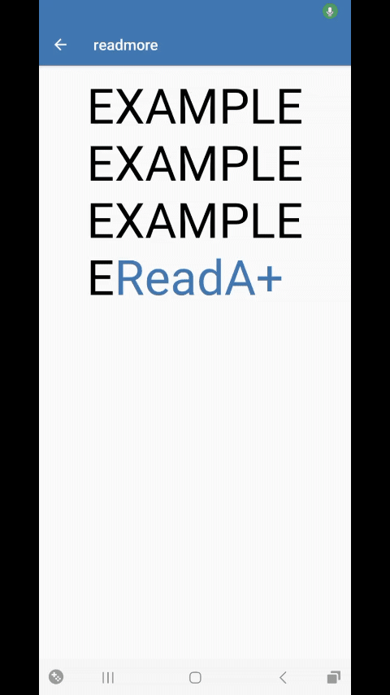

<center></br><b>ReadMore-TextView</b> Te permitirá acortar tus textos a un cierto número de lineas y añadira la opción de abrir el texto completo o volverlo a cortar.
    </br> </br>
    
</center></br>

## Implementación

Añade a tú proyecto los archivos de la carpeta "Library". No olvides los Resources: attr, strings y colors.

## Inicio

Añade el layout a tú xml.

```xml
<yourpackage.ReadMoreTextView
 android:id="@+id/textview1"
 android:layout_width="wrap_content"
 android:layout_height="wrap_content"
 android:padding="8dp"
 android:text="Example\nExample\nExample\nExample\nExample\nExample"
 android:textSize="18sp"
 android:textColor="#000000"
 app:readMoreColor="@color/colorPrimary"
 app:readMoreMaxLine="4"
 app:readMoreText="ReadA+" />
```

¡Y ésto es todo!
Ahora podrás extender y acortar los textos largos en tú App.
